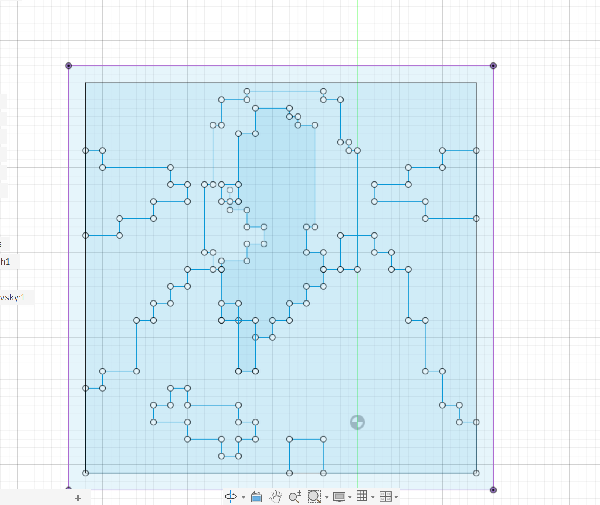
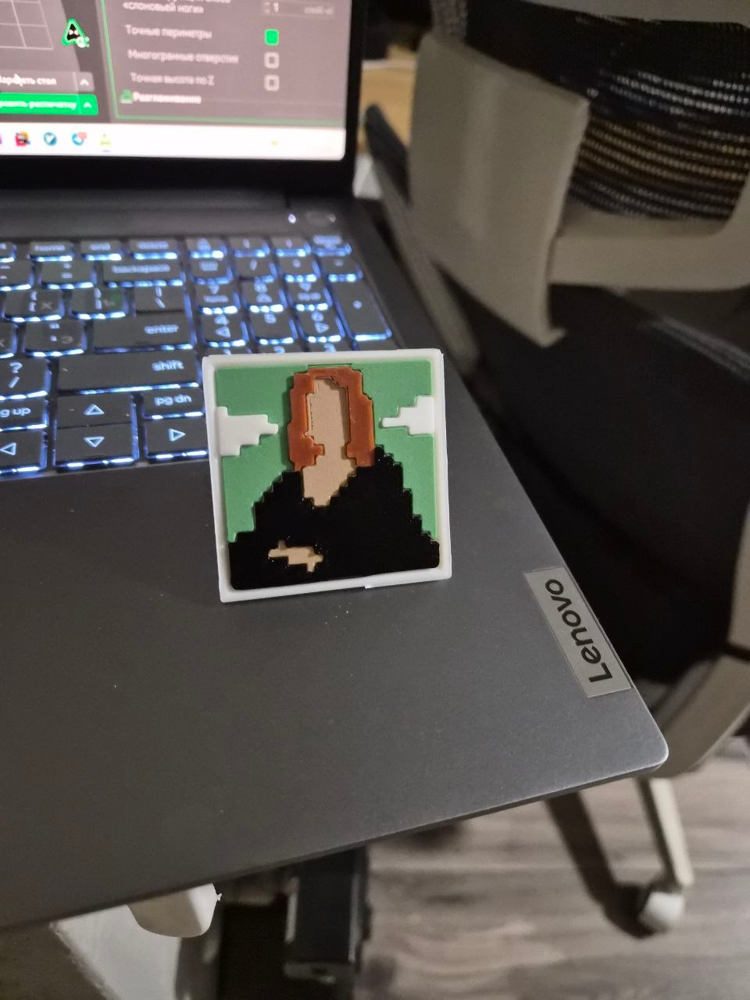

# Pixel Brush for Fusion 360

## What it does

- Paints square cells while you click/drag.
- Stores cells in memory instead of creating sketch lines immediately.
- Shows the current pixels using Custom Graphics.
- Supports Draw and Erase modes.
- Clear Pixels removes the temporary drawing.
- Pressing OK generates only boundary lines.
- Adjacent collinear boundary edges are merged, reducing sketch complexity.
- Holes are preserved.

## Install

1. Extract the `PixelBrush` folder.
2. In Fusion 360 open:
   Utilities -> Add-Ins -> Scripts and Add-Ins -> Add-Ins.
3. Press the `+` button and select the extracted `PixelBrush` folder.
4. Run `PixelBrush`.
5. Create/edit a sketch.
6. Run `Pixel Brush` from the Sketch Create panel.

## Usage

- Pixel size: cell size, e.g. 2 mm.
- Mode = Draw: add cells.
- Mode = Erase: remove cells.
- Clear pixels: clear preview.
- Click or drag over the sketch.
- Press OK to generate the final sketch boundary.
- Cancel discards the temporary pixels.

## Example

Pixel Brush can be used to draw stepped outlines for layered or multicolor parts. After turning the sketch profiles into model features, the result can be manufactured as a physical pixel-art part.

| Fusion 360 sketch | Finished multicolor print |
| --- | --- |
|  |  |

## Note

The mouse-to-sketch mapping assumes the usual Fusion sketch-editing view where the camera is normal to the sketch plane. This is the normal state when editing a sketch.
